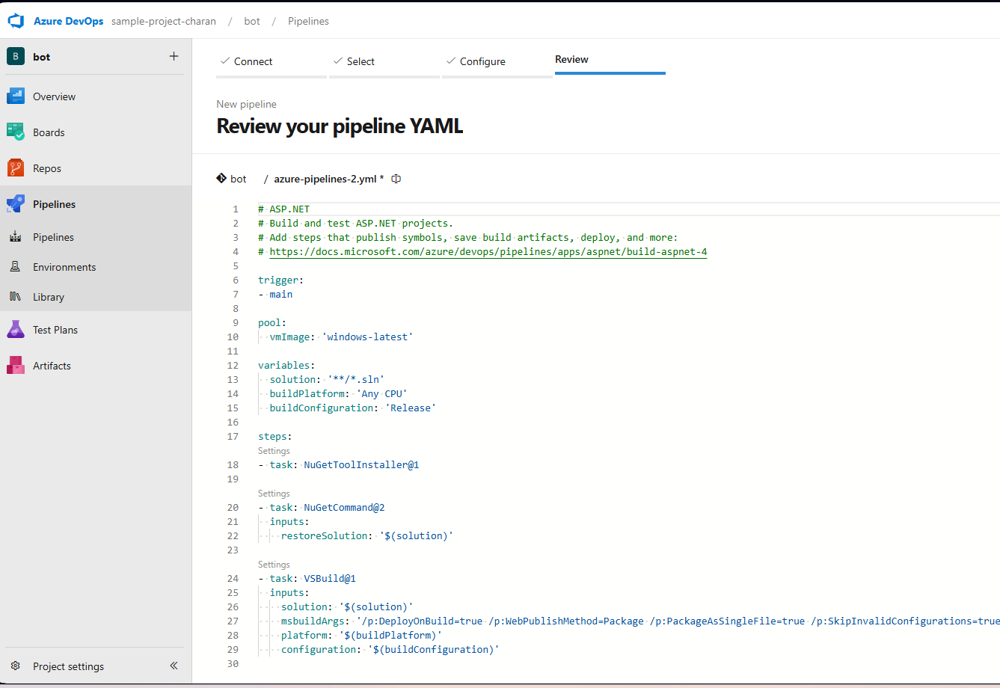

# Bot-web
---
# video link of the project working ------------- (https://drive.google.com/file/d/13YLY7zCiUT5tIk5xuJofqbaQeHCJHbSs/view)  Please ignore the voice 
## Objective of  The project :
This project is mainly focused on  DevOps  Part  to create CICD pipeline  for a dot net MVC framework application and make it live(Host) by using Azure cloud

## About Project:
```
This is a Dot net project which is developed by using [ASP.NET](http://ASP.NET) MVC   framework

This is the file structure of the project 

MyMvcApp
├── Controllers
│   └── HomeController.cs
├── Models
│   └── SampleModel.cs
├── Views
│   ├── Home
│   │   └── Index.cshtml
│   └── Shared
│       └── _Layout.cshtml
├── wwwroot
│   ├── css
│   │   └── site.css
│   └── js
│       └── site.js
├── appsettings.json
|—- bot.sln
|—- botapp.csproj
├── Program.cs
├── Startup.cs
└── [README.md](http://readme.md/)
```

MVC framework is well know for it structured and clear way of presenting the project for that reason we are using it 
where MVC is know as 

M - Model         (is like database manages data and business logics)
V - View             (it contains UI code for this project we have  HTML, C#)
C - Controller  ( it act as a middle layer between model and view)

### wwwroot : 
this folder contains static code , images which can be used by mostly in view section 

 ### bot.sln:
this is plays an important role in CI part where it contains all the connection between the projects Like databases, bussiness logic, and so on 
but in our project we don’t need it because we are using only one project we can just use direct .csproj file

### appsettings.json :
 This file mainly contains the credentials of the environment ( where to deploy the application) it is very usefull when we are working with multi-environments

### botapp.csproj:
 In this project for CI part this is the single most important file to built artifact. It tell what to use like frame work , location of the files and there dependences and so on based on the project requirement,
This file helps to built artifact in this case it helps MSbuilt to how Built artifacts

### program.cs : 
this file consist instructions how  the application work (it’s more like an engine)

 
### Startup.cs :
 this is same as program.cs file which is used to set the application and runs it. 
  In this project we are using both sartup.cs and program.cs

This is the basic view of our project and how it works

## Technologies Used
- ASP.NET Core MVC
- C#
- Razor Views
- HTML/CSS/JavaScript

## Features
- Home page with a simple greeting and about page.
- Sample data model to demonstrate MVC functionality.
- Responsive design with CSS styling.
- JavaScript for enhanced user interaction.


### For this project we are mostly using Microsoft azure services

Steps:

Step1 : Create a project name bot in Azure devOps


Step2 :  After creating it we need to push our local repo to azure repo’s

for this we are using git (it is a version controlling system) 
 1st connect to remote repo by using 

git remote add origin https://github.com/yourusername/your-repo.git command

then use this git commands 

git init 

git add .

git commit -m “first commit”

git status —> to check everything correct

git push 

after this your local repo would be push to remote repo and connection between local repo and remote repo will be established through git

it should look like this


Step3 : Creating CI pipe line

   To create CI pipe line go to pipe-line option on left side of the screen (azure dev page)

   click on create 

### follow this steps


here click on azure repo Git because our code present it that repo


Select repository, In our case we have bot repo where our project files are stored. Select it


Here you can select any option from top three or if you are using my repo you can use last option then you can select it from repo YMAL CI code. 
Here I am selecting first option



Now you can see yaml file which is created automatically 

you don’t need to edit this at this time but you need to a one task at the end after built stage 
that is publish task 
for that u can you my code or 
in the code editor goto task which present top right side  of the page 
search for publish select (publish built artifacts)
then no need to change anything just add it, It will storre the built artifacts in default publish location
then run it 

task adding process


this would be output


then run it 

after running successfully you can see artifact(file) present in publishes section that is the built artifact


these are the files present in it 


now I would like to explain in short YMAL file of CI. then we move on to creating hosting server

YMAL CI FILE

trigger:           ## This is trigger it will monitor in this case main branch if any changes in that it will tigger this pipe-line  
- main
 
pool:  
vmImage: 'windows-latest'  --------    ## This is vm which is created by azure to run this process then it will be destoryed after compliction of all tasks  
  
variables:  ---------------------------  ## these are local varible that can be used in this code
solution: '**/*.csproj'  
buildPlatform: 'Any CPU'        
buildConfiguration: 'Release'  

steps:  
- task: NuGetToolInstaller@1    ----------------------   ## this task install the dependence of .net application

-  task: VSBuild@1              ----------------------    ## this task built's artifact by using botapp.csproj file
    
-  task: VSTest@2              ----------------------   ## this will tast the application but in this case it won't do anything
   
 -   task: PublishBuildArtifacts@1   --------------------  ## this task will publish artifact to publish location which is defaultrepository for storing artifacts
     


Step 4 : Creating hosting environment based on our requirement (in our case Azure app services)  
For that Goto  
Azure cloud  > search for app service > click on Create (then you can see this page)


while creating azure app one thing is most important that is selecting Runtime stack ( frame work to run) this version must match with the version that present in program.cs file 

then create it  and deploy it after deploying it it look like this


Now let’s create CD pipe to deploy artifacts to this app service   

Step 5 : Creating CD pipe-line  

to create CD we can you seme yaml file as well but it is butter to create separately for butter structure   

follow same steps to create CD as well   
select pipeline > project > repo > here better to select starter pipeline  

this is the YMAL code for CD part ( which is very smiple for now but it can be complicated based on our requirements)

Here we have only two tasks  

1 downloads artifacts to running VM  

2 push’s to derived environment    


trigger:    
- none
 pool:
vmImage: 'windows-latest'  ------------------   ## VM where these tasks runs created by azure or service provider

steps:  

- task: DownloadPipelineArtifact@2 ------------------------ # downlaods artifacts from CI publish location and it will download only latest one

- task: AzureRmWebAppDeployment@5 -------------------------  # this task will publish it to derived invironment in our case azure app service

- finally after deploying you can see your web page live
  
This is the Link to the video of  project work flow  

Link
